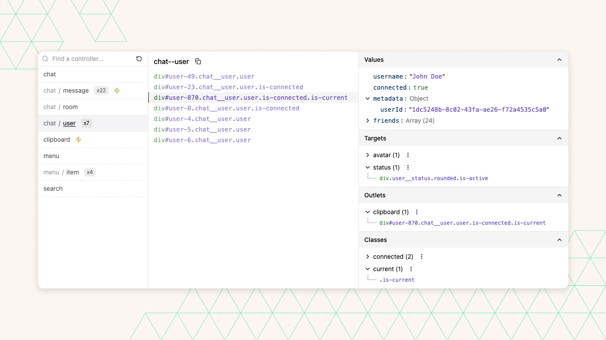

<div align="center">
    <br>
    
    <br>
</div>

<h4 align="center">A developer tool for debugging Stimulus applications at runtime.</h4>

## Overview

The Stimulus DevTools Chrome Extension is an open-source tool designed to simplify the process of debugging [Stimulus](https://stimulus.hotwired.dev/) on a web page. It provides a user-friendly interface for inspecting values, targets, outlets, and classes of Stimulus controllers, all directly from Chrome's DevTools.

*Inspired by the amazing [Vue DevTools](https://github.com/vuejs/devtools) and [Nuxt DevTools](https://github.com/nuxt/devtools).*



## Features

- ✨ **Controllers List:** Get a quick view of all Stimulus controllers present on the current page.
- 🔍 **Property Inspection:** Inspect values, targets, outlets, and classes associated with each controller.
- ✏️ **Real-time Modification:** Change controller's values on-the-fly and observe immediate updates.

## Usage

### Install the Extension

[//]: # (TODO: Add link)
Download and install the Stimulus Debugger Chrome Extension from the Chrome Web Store (link to be provided).

### Open Stimulus DevTools

1. Navigate to your web page where Stimulus controllers are used.
2. Open Chrome DevTools by right-clicking on the page, selecting "Inspect", or using the keyboard shortcut (Ctrl+Shift+I on Windows/Linux or Cmd+Opt+I on macOS).
3. In Chrome DevTools, go to the "Stimulus" tab.

### Enable Stimulus DevTools on your project

Ensure that the Stimulus application is added to `window.Stimulus` in your project. This is necessary for the extension to detect and display the Stimulus controllers properly.

For example :
```javascript
// src/application.js
import { Application } from "@hotwired/stimulus"

import HelloController from "./controllers/hello_controller"
import ClipboardController from "./controllers/clipboard_controller"

window.Stimulus = Application.start() // <- Here
Stimulus.register("hello", HelloController)
Stimulus.register("clipboard", ClipboardController)
```

## License

This project is licensed under the [MIT License](LICENSE).

---

> [robinsimonklein.com](https://robinsimonklein.com) &nbsp;&middot;&nbsp;
> GitHub [@robinsimonklein](https://github.com/robinsimonklein) &nbsp;&middot;&nbsp;
> 𝕏 [@rsimonklein](https://twitter.com/rsimonklein)
